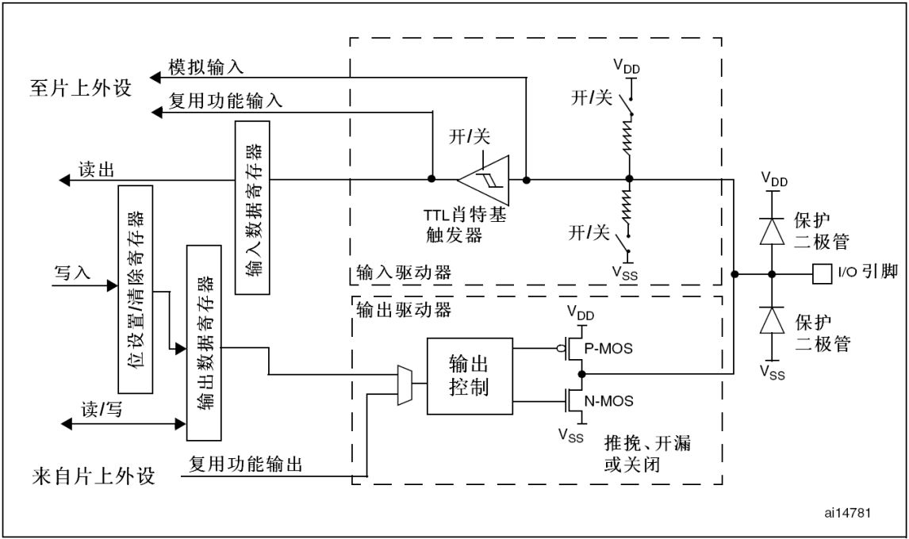
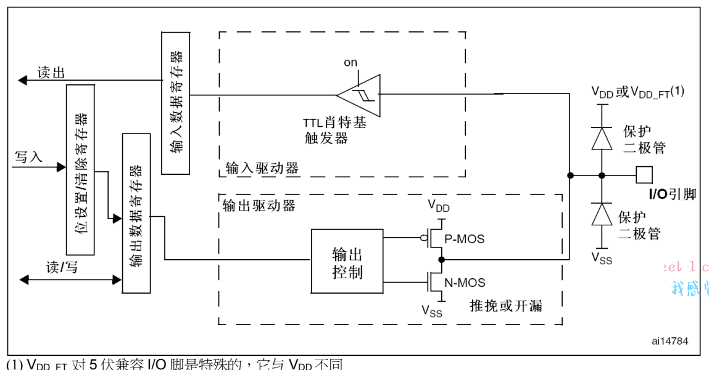
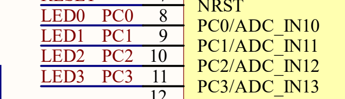
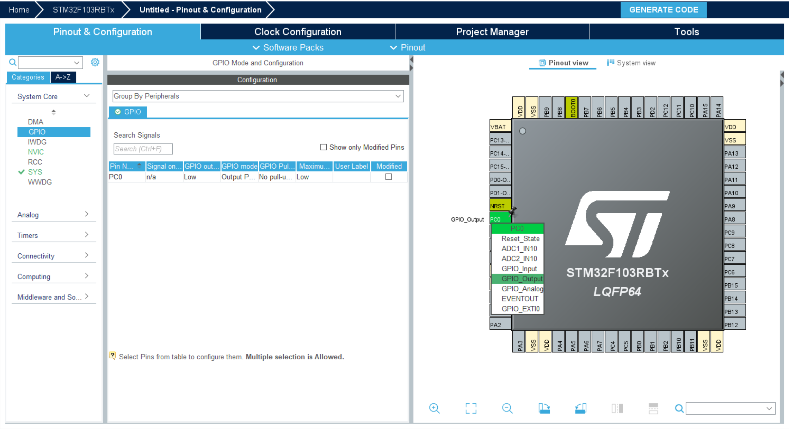
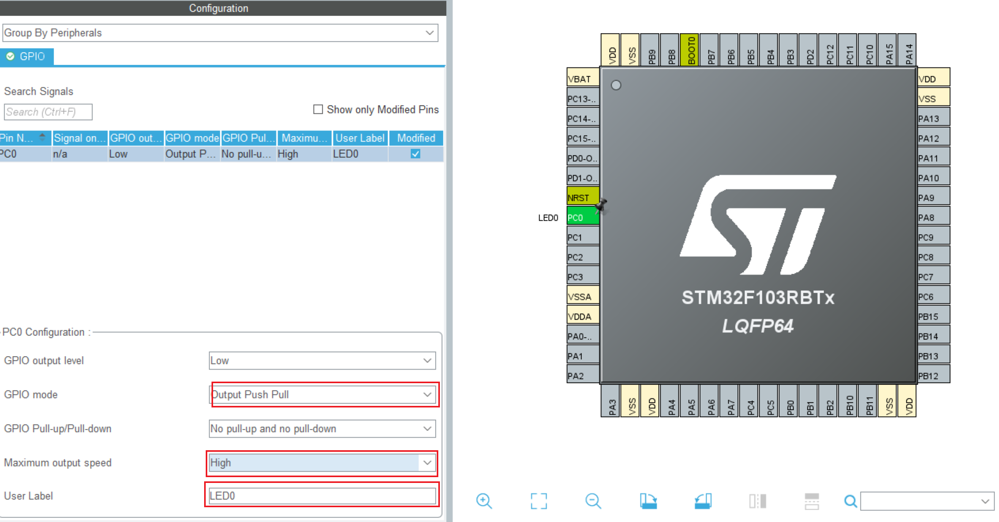
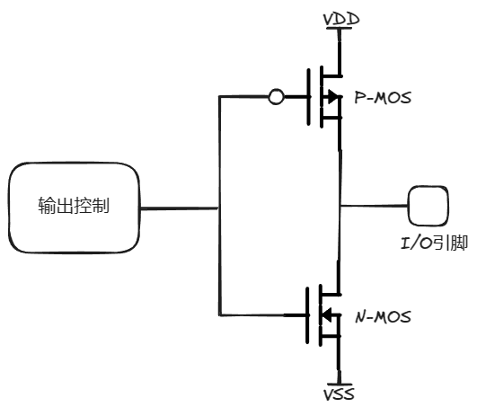
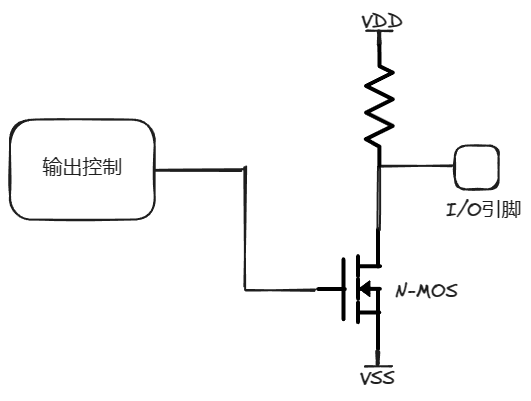

# GPIO通用输入输出端口

每个GPIO引脚都可以由软件配置成输出(推挽或开漏)、输入(带或不带上拉或下拉)或复用的外设功能
端口。多数GPIO引脚都与数字或模拟的复用外设共用。除了具有模拟输入功能的端口，所有的GPIO
引脚都有大电流通过能力。

在需要的情况下，I/O引脚的外设功能可以通过一个特定的操作锁定，以避免意外的写入I/O寄存器。
在APB2上的I/O脚可达18MHz的翻转速度。

上述是STM32官方对于GPIO的概述，有特别多的繁杂的概念和生词，接下来，让我通过大白话给大家翻译一下

首先，我们要有一个概念对于单片机来说，也就是内核来说他只有计算的功能即计算如：1+1，他是没有办法去实现我们现实看到的点灯的操作的，但是，通过GPIO就打通了内核和外部的连接，内核可以通过操作寄存器的方式来实现：拉高/拉低端口电压，读取来自端口的电压(
模拟/数字)，这样子就打通了单片机和外部环境的连接。

接下来，我们来分析一下STM32GPIO结构框图。



## GPIO输出

### 简介



通过将GPIO配置成输出模式，就可以是实现输出电压，读取当前输出的电压，这样我们就是可以实现一个简单的闪烁LED了。

### 实践操作

接下来，我们来看看GPIO输出如何实现，通过stm32CubeMX可以快速的配置GPIO的模式。

查看LED的原理图确定GPIO绑定在那个引脚上。



这里我们使用 **LED0** 作为示例的LED，可以看到 **LED0** 绑定的引脚是 **PC0** ，那么只要将 **PC0** 配置成GPIO输出模式就可以驱动LED实现
**LED闪烁** 。





#### GPIO配置的参数

|          参数          |    参数    |                 选项                  |     选项     |
|:--------------------:|:--------:|:-----------------------------------:|:----------:|
|  GPIO output level   | 初始GPIO电平 |              Low/High               |  低电平/高电平   |
|      GPIO Mode       |  GPIO模式  | Output Push Pull /Output Open Drain | 推挽输出 /开漏输出 |
| Maximum output speed |  最大输出速度  |           Low/Medium/High           | 低速/中速度/高速  |
|      User Label      |   用户标签   |              Optional               |     选项     |

+ 推挽输出/开漏输出

1. 推挽输出

   结构:推挽输出结构包括一个PNP型和一个NPN型晶体管，它们工作在互补的工作状态。当一个晶体管导通时，另一个截至。

   

   对于推挽输出来说，具有很强的驱动能力，但是，不具有 **线与** 功能。

2. 开漏输出

   结构:开漏输出结构包括一个N型晶体管，只能拉低输出信号，而不能拉高。为了实现完整的输出电路，需要外部上拉电阻。

   

   对于开漏输出来说，由外部上拉电阻决定驱动能力，但是，具有 **线与** 功能，可以用作信号通信。

|    \    | 推挽输出 |   开漏输出    |
|:-------:|:----:|:---------:|
| 高电平驱动能力 |  强   | 由外部上拉电阻提供 |
| 低电平驱动能力 |  强   | 由外部上拉电阻提供 |
| 电平跳变速度  |  快   | 由外部上拉电阻提供 |
|  线与功能   | 不支持  |    支持     |
|  电平转换   | 不支持  |    支持     |

#### 实现LED闪烁

```c
int main(void)
{
    // 省略初始化代码
    /* Infinite loop */
    /* USER CODE BEGIN WHILE */
     while (1)
     {
         HAL_GPIO_TogglePin(LED0_GPIO_Port,LED0_Pin);
         HAL_Delay(500);
       /* USER CODE END WHILE */
   
       /* USER CODE BEGIN 3 */
     }
    /* USER CODE END 3 */
}
```

## GPIO输入