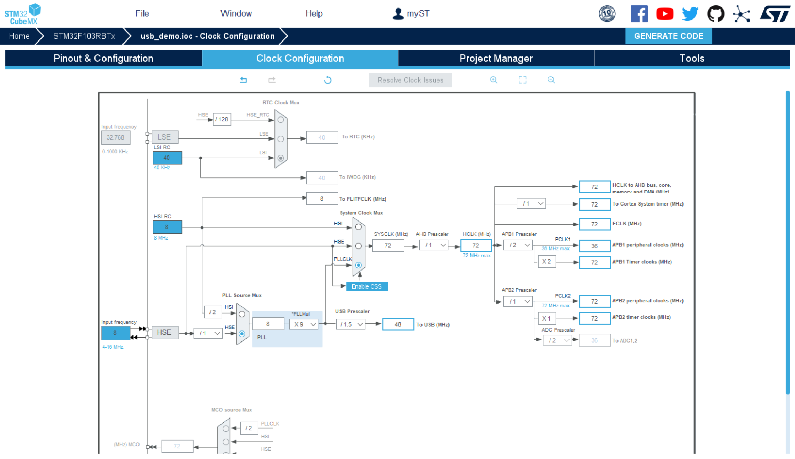
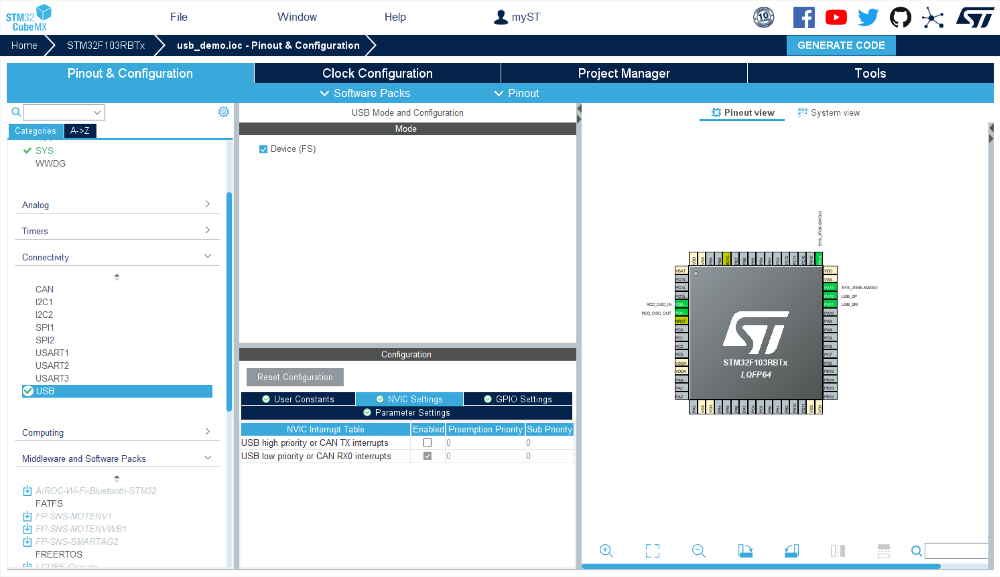
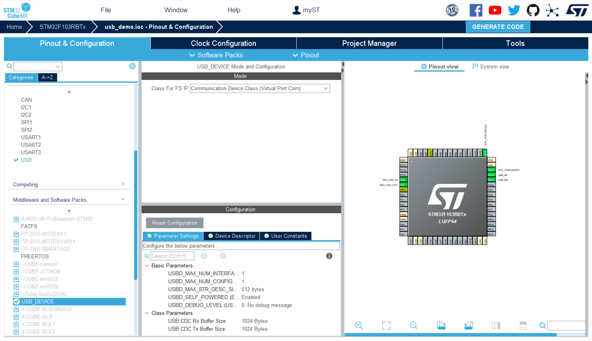
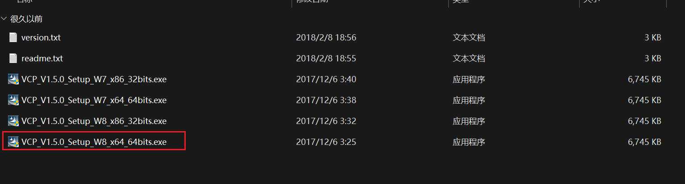
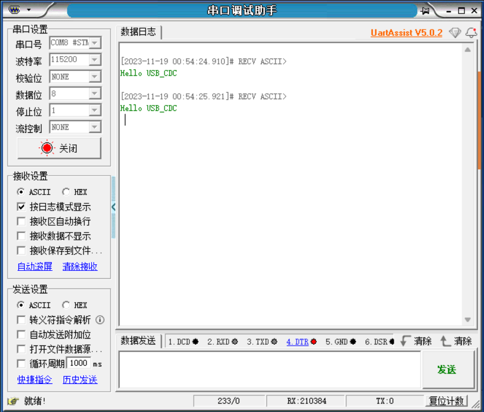

# USB学习

## 测试STM32F1USB(CDC)

使用stm32cubx生成测试demo

[//]: # (TODO:需要连接到基础配置文章)
- 基础设置请参考[基础配置]()







### usb发送数据到上位机

通过`usbd_cdc_if.c`中的`CDC_Transmit_FS`

```C
uint8_t CDC_Transmit_FS(uint8_t* Buf, uint16_t Len)
{
  uint8_t result = USBD_OK;
  /* USER CODE BEGIN 7 */
  USBD_CDC_HandleTypeDef *hcdc = (USBD_CDC_HandleTypeDef*)hUsbDeviceFS.pClassData;
  if (hcdc->TxState != 0){
    return USBD_BUSY;
  }
  USBD_CDC_SetTxBuffer(&hUsbDeviceFS, Buf, Len);
  result = USBD_CDC_TransmitPacket(&hUsbDeviceFS);
  /* USER CODE END 7 */
  return result;
}
```

在`main.c`中编写代码,发送`Hello USB_CDC`到上位机

```c++
int main(void){
    // 省略cubx生成的初始化代码
    uint8_t buf[] = "Hello USB_CDC\r\n";
    while(1){
        CDC_Transmit_FS(buf,sizeof(buf));
        HAL_Delay(1000);
    }
}
```

### 安装stm32cubx虚拟串口驱动

[https://www.st.com/zh/development-tools/stsw-stm32102.html](https://www.st.com/zh/development-tools/stsw-stm32102.html)

> 根据自身电脑的架构选择合适的驱动,驱动版本建议选择W8



### 验证开发

打开串口调试助手,选择对应的串口号,波特率随意选择不影响实验效果



## 初步了解USB

## 探究STM-USBLib

### USB初始化流程

> 参考链接
> https://blog.csdn.net/jimaofu0494/article/details/109233087