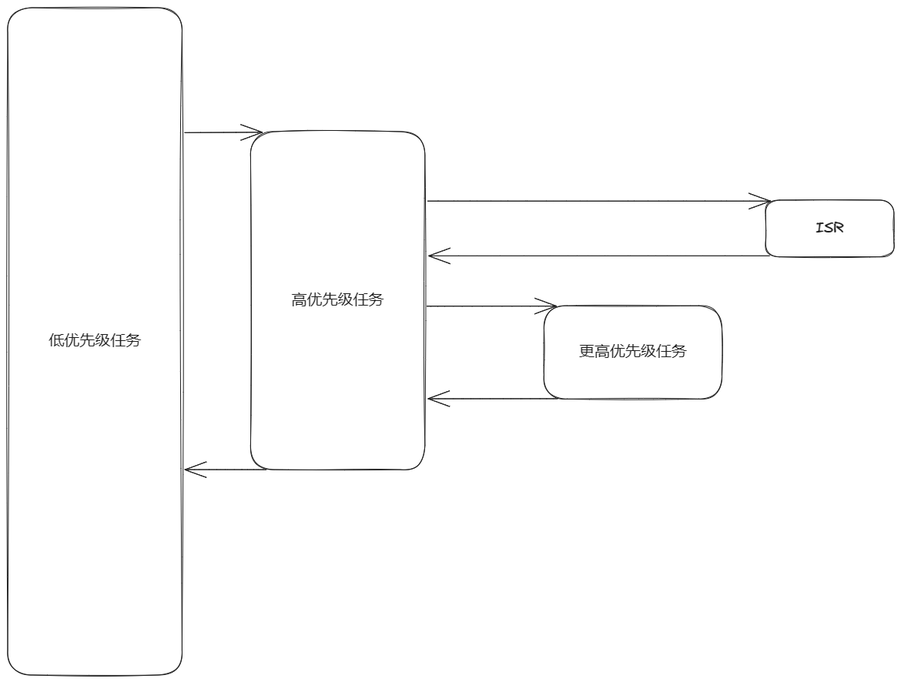

# 移植RTOS到NANO

## 准备一个完整的工程可以正常编译下载的工程

> 待施工

## 线程管理

### 抢占式多任务系统

多任务系统就是将以前的大任务拆分成一个一个任务运行，各个任务通过信号量等进行通信。

对于每一个线程任务来说，它永不返回。这样子就保证了每一个任务独立，并且对于多任务系统来说还会有关于优先级的描述，这样对于整个系统来说实时性得到更大的提高。

1. 实时性
2. 便利性

